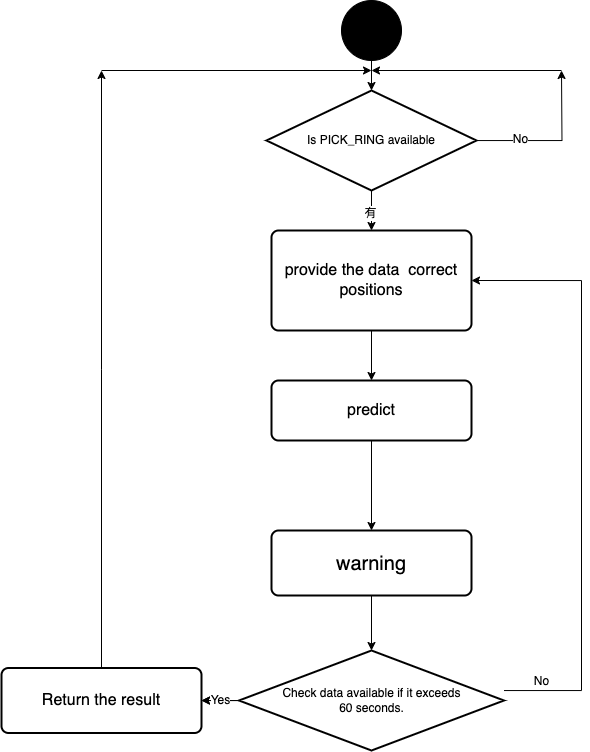

# SENSE Model on earthworn system

## 簡介
本系統用於接收earthworn system 的地震波資訊進行地震預警，其中利用SENSE模型做預警。 

## Table of Contents

- [Introduction](#introduction)
- [Install](#install)


## Introduction

我們遵守圖上流程，
步驟一：先確認PICK RING 是否有資料
步驟二：將資料依照SENSE模型設定做前處理
步驟三：預警
步驟四：發警報
步驟五：持續步驟一到五60秒
步驟六：回傳結果
* <a href=""></a>


## Install & RUN

- SENSE Model checkpoint[https://drive.google.com/file/d/1leZ15WJegQ_ibTYY24PcTKo_1m1RtCX1/view?usp=sharing]
- 請先下載好earthworn system 和 設定好PICK模組，確認PICK模組會將picking資料寫進PICKRING


```sh
$ git clone https://github.com/skysora/earthworm_predict
$ cd ./earthworm_predict
$ python3 EEW_new.py
```
  
## Todo

- 將儀器位置移至正確高程
- 將結果同步傳送至雲端

